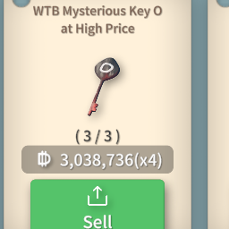
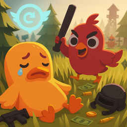
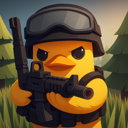
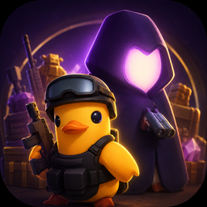

## [Black Market Price Comparison](./Black_Market_Price_Comparison/) 
[Steam Workshop (tested on Duckov v1.2.5)](https://steamcommunity.com/sharedfiles/filedetails/?id=3618087266)

Shows how many times higher the black market item price is compared to its original price.

## [Death Rewind](./Death_Rewind/) 
[Steam Workshop (updated for Duckov v2.3.30)](https://steamcommunity.com/sharedfiles/filedetails/?id=3615819913)

Upon death, your items are restored to their state before you went out.

## [Enhanced ADS](./Enhanced_ADS/) 
[Steam Workshop (updated for Duckov v2.3.30)](https://steamcommunity.com/sharedfiles/itemedittext/?id=3600556258)

Adds configurable ADS camera behavior, stable sensitivity, aim-distance feedback, and optional auto-reload.

## [Super Black Market](./Super_Black_Market/)
[Steam Workshop (updated for Duckov v2.3.30)](https://steamcommunity.com/sharedfiles/itemedittext/?id=3733212359)

Displays a searchable, localized item catalog grouped by tag order through black market demand and supply lists, with unlimited trades and inventory-first purchases.

